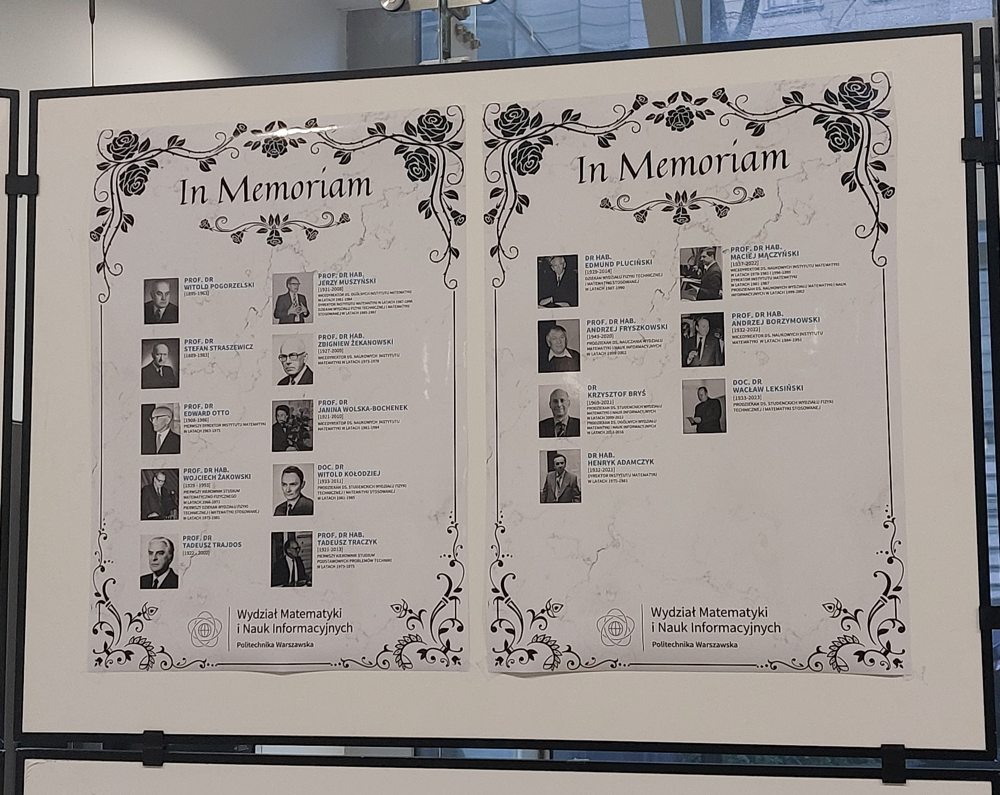
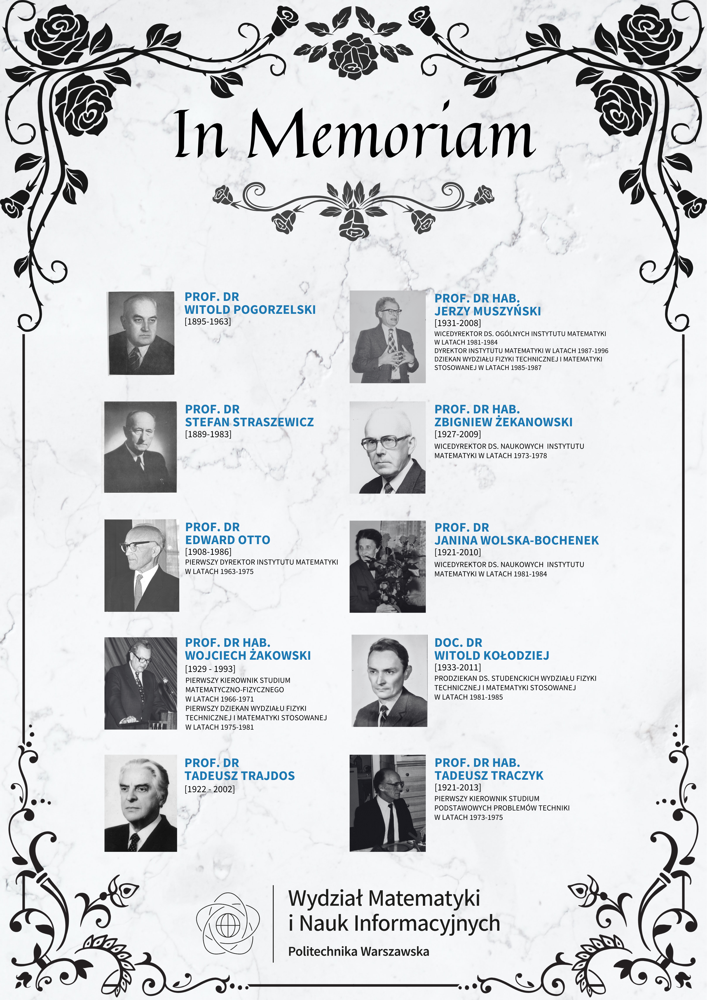

Zostałam poproszona przez ówczesnego przewodniczącego Wydziałowej Rady Studentów o pomoc w stworzeniu ilustracji potrzebnych na obchody 25-lecia Wydziału Matematyki i Nauk Informacyjnych.
Jubileusz był obchodzony 28.11.2024 r. Moim zadaniem było stworzenie tablicy upamiętniającej zmarłych profesorów Wydziału. 

Tablice są nadal powieszone w budynku Wydziału MiNi. Znajdują się na parterze za szklanymi windami.  

