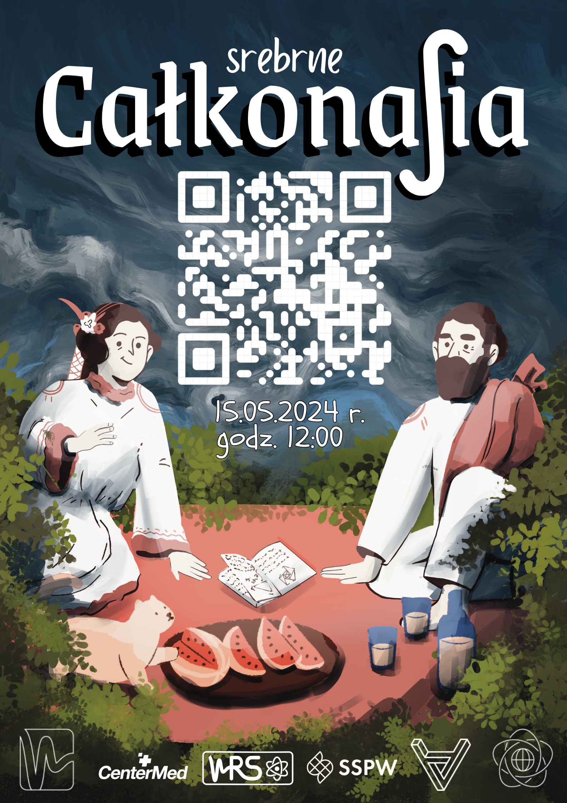
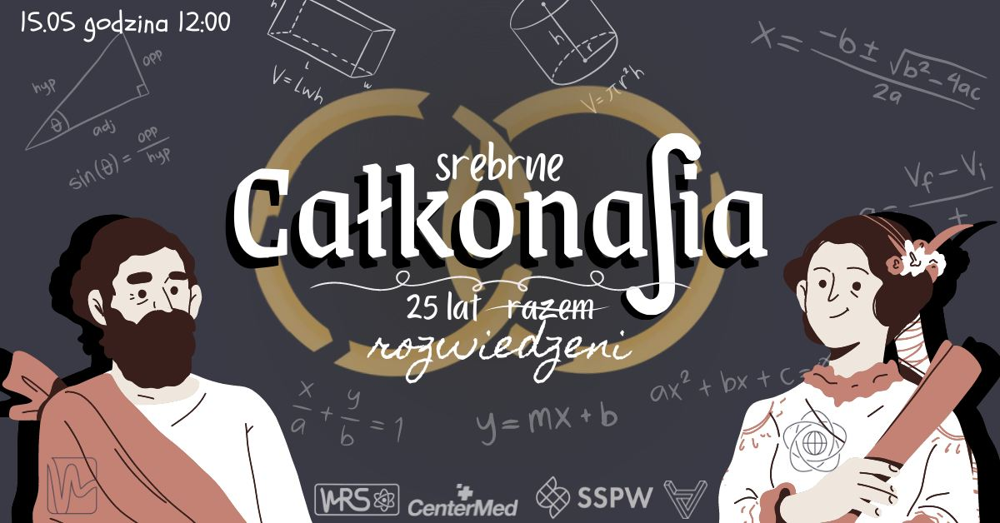
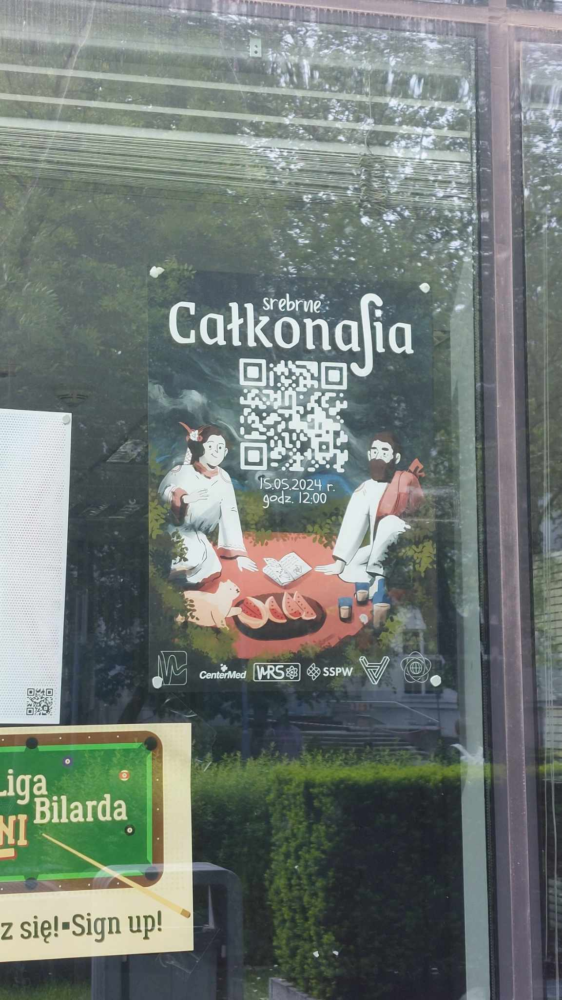

Miałam zaszczyt zajmować się oprawą graficzną corocznego pikniku Wydziału Matematyki i Nauk Informacyjnych oraz Wydziału FIzyki w 2024 roku, tzn. "Całkonalia". .
Poniżej znajduje się część przygotowanych ilustracji.

Poniżej znajduje się plakat promujący wydarzenie. Plakat ten jest dla mnie szczególnie ważny ze względu na to, że tło namalowałam ręcznie w programie graficznym od zera.

 
Tło na wydarzenie na Facebook:

Plakat powieszony w budynku: 

