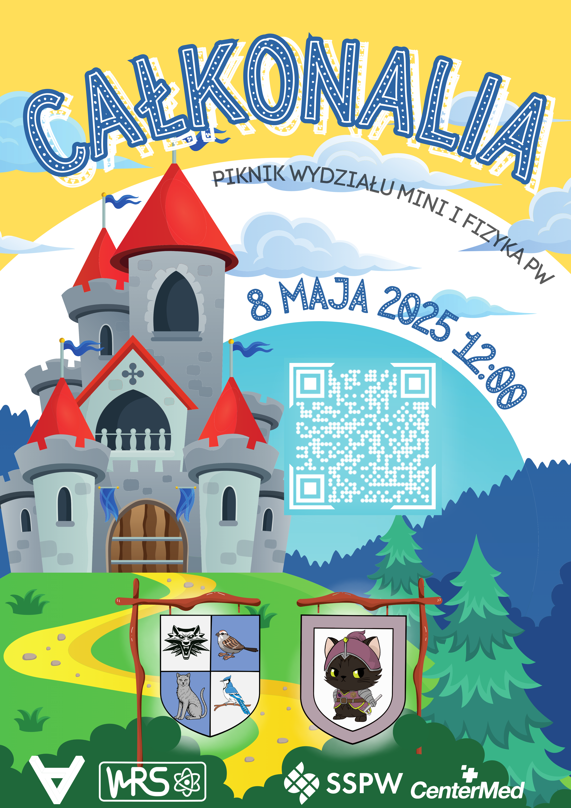
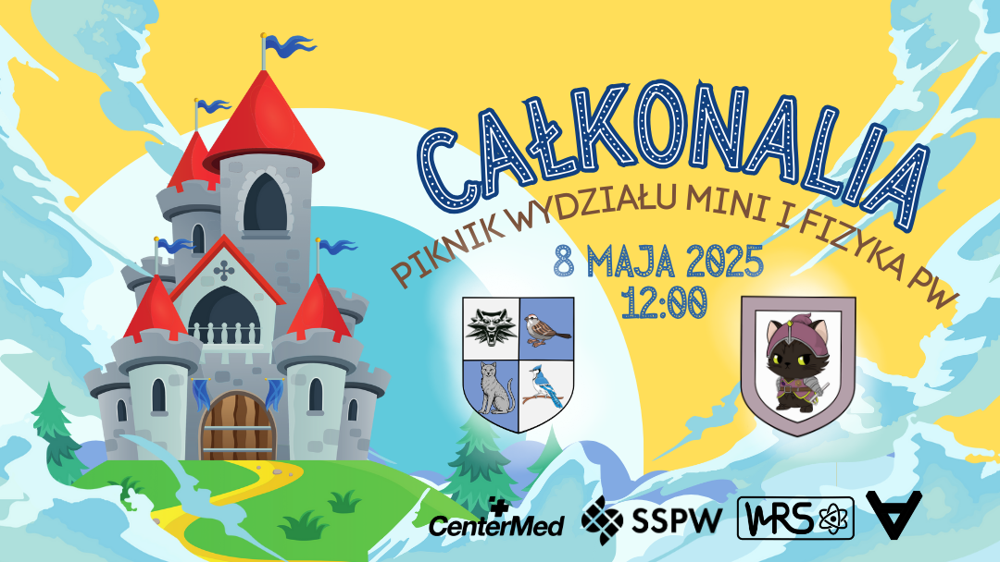
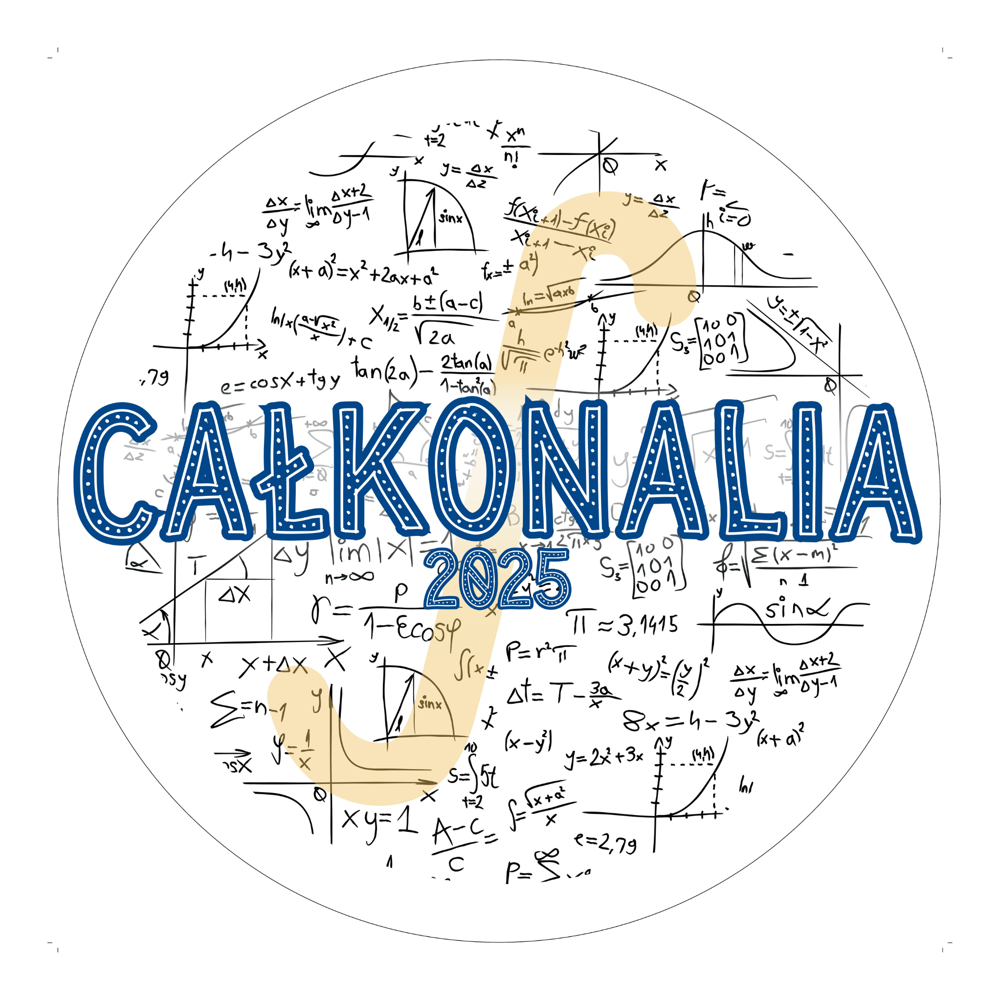
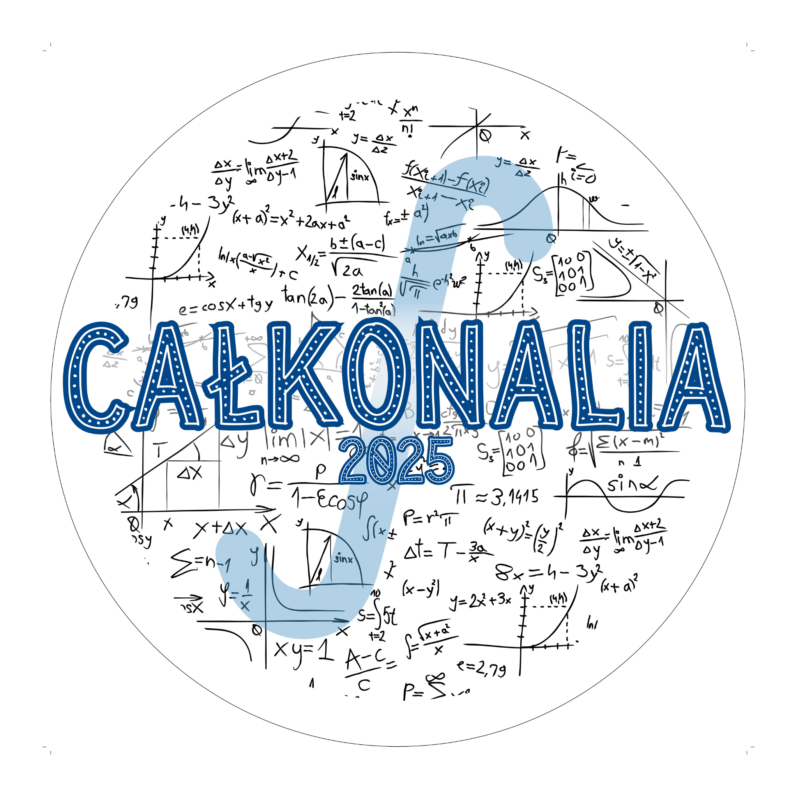
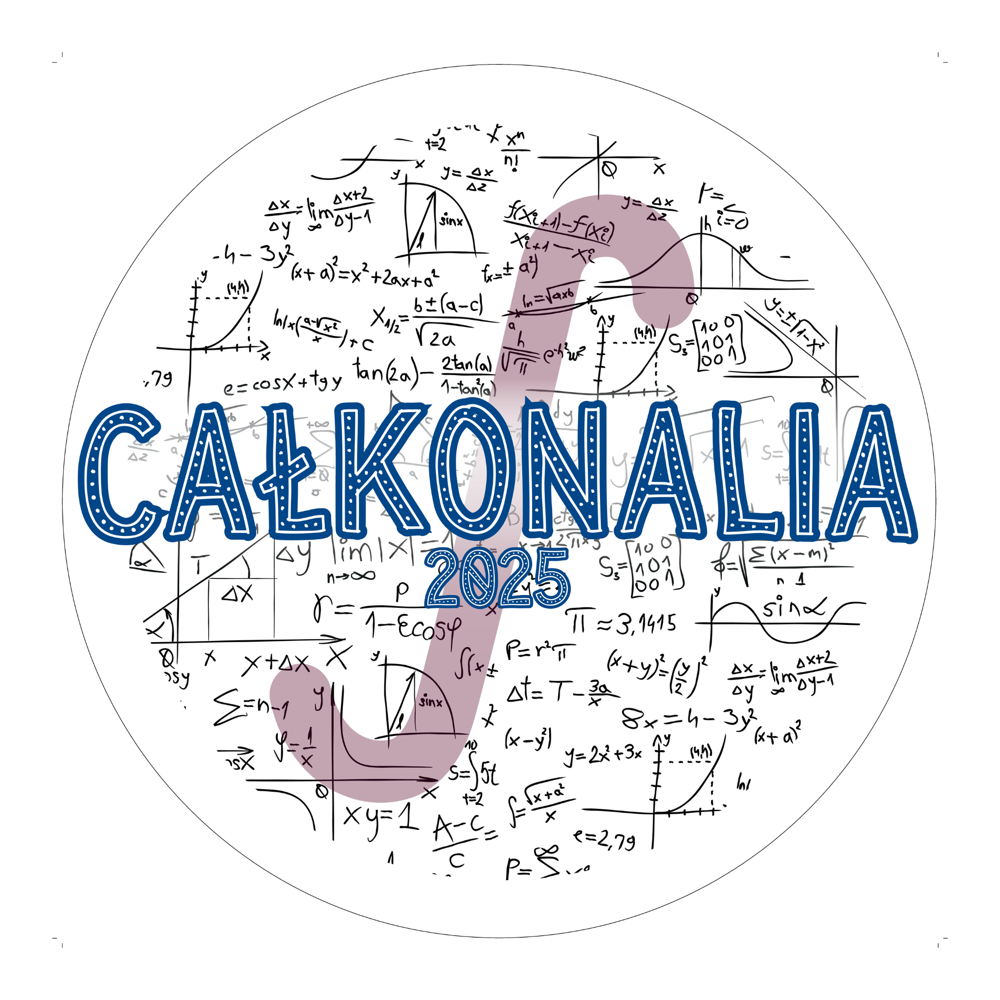
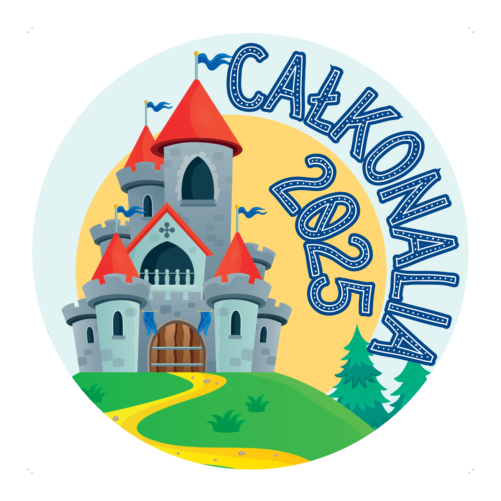
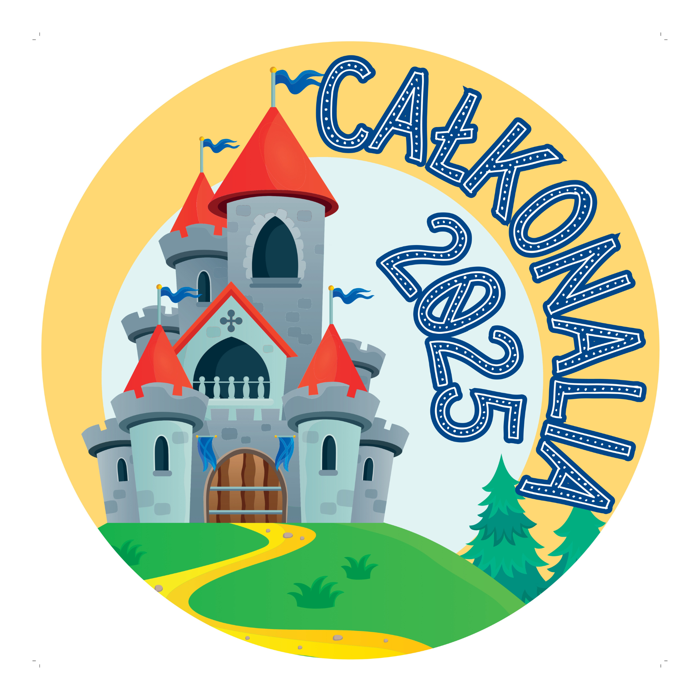

Wykonałam teogroczoną oprawę graficzną pikniku Wydziału Matematyki i Nauk Informacyjnych oraz Wydziału FIzyki w 2025 roku, tzn. "Całkonalia".
Poniżej znajduje się część przygotowanych ilustracji.

Poniżej znajduje się plakat promujący wydarzenie:

 
Tło na wydarzenie na Facebook:

Projekty naklejek rozdawanych na wydarzeniu:

